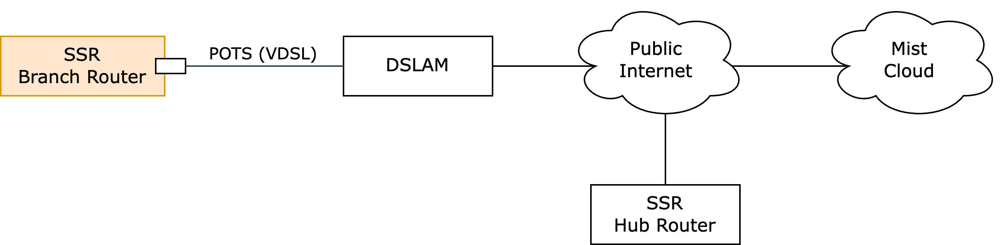
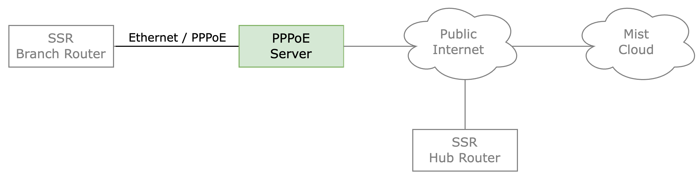
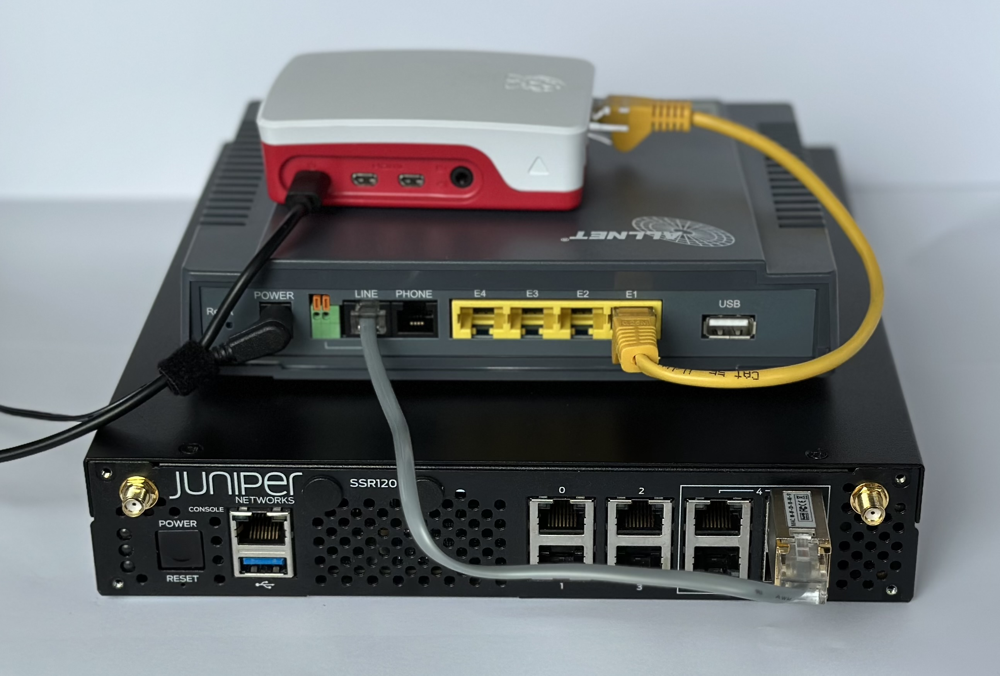
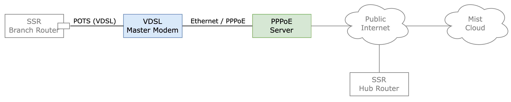

# PPPoE with SSR (WAN Assurance)

In the first part of this document you will be guided through the steps, that are needed to onboard an SSR120/SSR130 router to the Mist cloud using a PPPoE connection only.

The second part outlines a method for PPPoE in a lab or staging area. 



## Onboarding

1. All steps in this document have been tested with an SSR120-AE (SSR release 6.2.5-5r2) and an Allnet ALL4781-VDSL2-SFP.
2. The SFP is connected to port 4 (`ge-0-4`) - [refer to this document](https://www.juniper.net/documentation/us/en/software/session-smart-router/docs/hdwr_ssr_device_port_layout/#ssr-120) for additional details.
3. You need a serial console cable and connect it to the `CONSOLE` port (baud rate 115200)

### Configuration

In this section we are going to use following PPPoE parameters and credentials:

| Parameter               | Value  |
| ----------------------- | ------ |
| PPPoE username          | jdoe   |
| PPPoE password          | secret |
| Authentication protocol | chap   |
| VLAN                    | None   |
 

After powering on the router it takes approximately 5 minutes until you can login with user `admin` and password `128Tadmin`. If the system is not yet ready (first boot initialization), you will see a `Login incorrect` error message:

```
CentOS Linux 7 (Core)
Kernel 4.18.0-513.18.0.2.el8_9.x86_64 on an x86_64

snXXXXXXXXXX login: admin
Password:
Login incorrect
```

In this case wait some time and try again.

After logging into the serial console, the network interfaces configuration should look like this, if there is just the SFP plugged into `ge-4-0`:

```
admin@node.router# show network-interface
...
======== ====== ============== =================== ============ ============= ============= ========== ========== ================== ============== ========== ======== ======
 Router   Node   Device         Name                Forwarding          VLAN   Device Type   Type       DHCP       Address            Gateway        Hostname   Status   GIID
======== ====== ============== =================== ============ ============= ============= ========== ========== ================== ============== ========== ======== ======
 router   node   bootstrapper   bootstrapper-intf   true                   0   host          external   disabled   169.254.254.1/29   --             --         up          1
 router   node   ge-0-0         ge-0-0-intf         true                   0   ethernet      external   v4         <unresolved>       <unresolved>   --         down        2
 router   node   ge-0-1         ge-0-1-intf         true                   0   ethernet      external   v4         <unresolved>       <unresolved>   --         down        3
 router   node   ge-0-2         ge-0-2-intf         true                   0   ethernet      external   v4         <unresolved>       <unresolved>   --         down        4
 router   node   ge-0-3         ge-0-3-intf         true                   0   ethernet      external   disabled   192.168.3.1/24     --             --         down        5
 router   node   ge-0-3         ge-0-3-intf         true                   0   ethernet      external   disabled   192.168.128.1/24   --             --         down        5
 router   node   ge-0-4         ge-0-4-intf         true                   0   ethernet      external   disabled   192.168.4.1/24     --             --         up          6
 router   node   ge-0-4         ge-0-4-intf         true                   0   ethernet      external   disabled   192.168.128.1/24   --             --         up          6
 router   node   ge-0-5         ge-0-5-intf         true                   0   ethernet      external   disabled   192.168.5.1/24     --             --         down        7
 router   node   ge-0-5         ge-0-5-intf         true                   0   ethernet      external   disabled   192.168.128.1/24   --             --         down        7
 router   node   lte-0-0        lte-0-0-intf        true         unsupported   lte           external   v4         <unresolved>       <unresolved>   --         down        8
```

Firstly, the device-interface `ge-0-4`, which should be used as a target-interface for PPPoE must be released. Normally, this is part of the bridge `br-128`. For this a Linux shell with root priviledges is necessary (password is `128tRoutes`):

```
admin@node.router# shell su -
Password:
[root@snXXXXXXXXXX ~]# sed -i '/BRIDGE=br-128/d' /etc/sysconfig/network-scripts/ifcfg-ge-0-4
[root@snXXXXXXXXXX ~]# exit
```

Secondly, the PPPoE config must be added to and the ge-4-0 device-interface must be deleted from the SSR config:

```
admin@node.router# configure authority router router node node delete device-interface force ge-0-4
*admin@node.router# configure authority router router node node device-interface pe-0-1 type pppoe
*admin@node.router# configure authority router router node node device-interface pe-0-1 target-interface ge-0-4
*admin@node.router# configure authority router router node node device-interface pe-0-1 pppoe user-name jdoe
*admin@node.router# configure authority router router node node device-interface pe-0-1 pppoe password secret
*admin@node.router# configure authority router router node node device-interface pe-0-1 pppoe authentication-protocol chap
*admin@node.router# configure authority router router node node device-interface pe-0-1 network-interface pe-0-1-intf source-nat true
*admin@node.router# configure authority router router node node device-interface pe-0-1 network-interface pe-0-1-intf mtu 1492
*admin@node.router# configure authority router router node node device-interface pe-0-1 network-interface pe-0-1-intf enforced-mss automatic
*admin@node.router# configure authority router router node node device-interface pe-0-1 network-interface pe-0-1-intf management true
*admin@node.router# configure authority router router node node device-interface pe-0-1 network-interface pe-0-1-intf management-vector name management_pe-0-1
*admin@node.router# configure authority router router node node device-interface pe-0-1 network-interface pe-0-1-intf management-vector priority 21
*admin@node.router# configure authority router router service-route internet-route-pe-0-1 service-name internet
*admin@node.router# configure authority router router service-route internet-route-pe-0-1 next-hop node pe-0-1-intf node-name node
*admin@node.router# configure authority router router service-route internet-route-pe-0-1 next-hop node pe-0-1-intf interface pe-0-1-intf
*admin@node.router# commit force
Validating, then committing...
Configuration committed
```

If your ISP requires a VLAN for the PPPoE connection, please use the `<target-interface>.<vlan-id>` syntax, e.g. `ge-0-4.7` for VLAN-ID 7.

Finally, perform a reboot of the router:

```
admin@node.router# shell su -
Password:
[root@snXXXXXXXXXX ~]# reboot
```

Once the router has started again, a PPPoE connection should come up. There is a new device `pe-0-1` in network-interfaces:

```
admin@node.router# show network-interface
...
======== ====== ============== =================== ============ ============= ============= ========== ============= ==================== =============== ========== ======== ======
 Router   Node   Device         Name                Forwarding          VLAN   Device Type   Type       DHCP          Address              Gateway         Hostname   Status   GIID
======== ====== ============== =================== ============ ============= ============= ========== ============= ==================== =============== ========== ======== ======
 router   node   bootstrapper   bootstrapper-intf   true                   0   host          external   disabled      169.254.254.1/29     --              --         up          1
 router   node   ge-0-0         ge-0-0-intf         true                   0   ethernet      external   v4            <unresolved>         <unresolved>    --         down        2
 router   node   ge-0-1         ge-0-1-intf         true                   0   ethernet      external   v4            <unresolved>         <unresolved>    --         down        3
 router   node   ge-0-2         ge-0-2-intf         true                   0   ethernet      external   v4            <unresolved>         <unresolved>    --         down        4
 router   node   ge-0-3         ge-0-3-intf         true                   0   ethernet      external   disabled      192.168.3.1/24       --              --         down        5
 router   node   ge-0-3         ge-0-3-intf         true                   0   ethernet      external   disabled      192.168.128.1/24     --              --         down        5
 router   node   ge-0-5         ge-0-5-intf         true                   0   ethernet      external   disabled      192.168.5.1/24       --              --         down        7
 router   node   ge-0-5         ge-0-5-intf         true                   0   ethernet      external   disabled      192.168.128.1/24     --              --         down        7
 router   node   lte-0-0        lte-0-0-intf        true         unsupported   lte           external   v4            <unresolved>         <unresolved>    --         down        8
 router   node   pe-0-1         pe-0-1-intf         true         unsupported   pppoe         external   unsupported   100.100.100.101/32   100.100.100.1   --         up          6
```

Now, it's time to check the mist connection status:

```
admin@node.router# show mist
...
====== ============ ============ ================ ================= =================== ============
 Name   Agent        Connection   128T             128T-mist-agent   Device-ID           Interfaces
====== ============ ============ ================ ================= =================== ============
        unassigned   up           6.2.5-5.r2.el7   4.16.6989-1.el7   90-ec-77-aa-bb-cc            0
```

This means, a connection to the Mist is established an the SSR (WAN Edge) can be claimed using the claim code, which is printed on the router.

## PPPoE Lab Testing

To test the onboarding instructions above a PPPoE server is very helpful. The following section provides instructions how to setup the `accel-ppp` software, which can run as a PPPoE server. The routing and source NAT is handled by the Linux kernel itself (via `iptables`).

For this type of lab setup no dedicated hardware (like in the VDSL section below) is required and the SSR and PPPoE server can also run as virtual machines on a hypervisor.



### PPPoE Server

Unfortunately, the common Linux distributions do not come with pre-built packages for accel-ppp. The following instructions should help to build an accel-ppp software package and install it afterwards. The instructions differ between Debian/Ubuntu (A1) and RHEL/CentOS based systems (A2).
The configuration and troublshooting instructions (B .. D) are the same for all systems.

#### A1 - Installation on Debian/Ubuntu

The following steps have been tested on a Debian 12.

##### Installing build packages
```
apt update && apt install -y build-essential cmake gcc linux-headers-`uname -r` git libpcre3-dev libssl-dev
```
##### Clone the repo
```
git clone https://github.com/xebd/accel-ppp.git /opt/accel-ppp-code
```
##### Build the code
```
mkdir /opt/accel-ppp-code/build
cd /opt/accel-ppp-code/build/
cmake -DCMAKE_INSTALL_PREFIX=/usr -DCPACK_TYPE=Centos9 -DKDIR=/usr/src/linux-headers-`uname -r` ..
make
```
##### Create DEB Package
```
cpack -G DEB
```
##### Install Package
```
dpkg -i accel-ppp*.deb
```

#### A2 - Installation on RHEL/CentOS

The following steps have been tested on a CentOS Stream 9.

##### Installing build packages
```
dnf install -y cmake git gcc openssl-devel pcre-devel rpm-build tcpdump
```
##### Clone the repo
```
git clone https://github.com/xebd/accel-ppp.git /opt/accel-ppp-code
```
##### Build the code
```
mkdir /opt/accel-ppp-code/build
cd /opt/accel-ppp-code/build/
cmake -DCMAKE_INSTALL_PREFIX=/usr -DCPACK_TYPE=Centos9 -DKDIR=/usr/src/linux-headers-`uname -r` ..
make
```
##### Create RPM
```
cpack -G RPM
```
##### Install RPM
```
rpm -i accel-ppp.rpm
```

#### B - Configuration (Debian/Ubuntu/RHEL/CentOS)

```
cat > /etc/accel-ppp.conf <<EOF
[modules]
log_syslog
pppd_compat
pppoe
ippool
auth_chap_md5
chap-secrets

[pppoe]
verbose=1
called-sid=mac
interface=eth1

[ip-pool]
gw-ip-address=100.100.100.1
100.100.100.100-199

[chap-secrets]
chap-secrets=/etc/pppoe/chap-secrets
EOF
```
```
mkdir /etc/pppoe
echo 'jdoe   *   secret  *' > /etc/pppoe/chap-secrets
```

#### C - Running the service

1. The `accel-ppp` service is not enabled by default (after package installation) and should be enabled. Otherwise it will not be started automatically after a host reboot.
2. After a reboot (or an explicit start of the service with `systemctl start accel-ppp`) should work. However, normally the Linux kernel would not route/forward IP packets coming from the PPPoE client (SSR router) and the internet. This can be achieved by enabling `net.ipv4.ip_forward` in the sysctl.conf file.
3. In most cases it will be also required to use source NAT to translate the PPPoE address(es) into the WAN interface IP address of the PPPoE server - `iptables` will do that trick. Unfortunately, there is no common way to run iptables on the different Linux flavors. It is recommended to use tools like `iptables-persistent` for this purpose:
 
```
# enable/start accel-ppp
sudo systemctl enable accel-ppp
sudo systemctl start accel-ppp

# enable IP routing
sudo sh -c "echo 'net.ipv4.ip_forward = 1' > /etc/sysctl.d/90-ip-forward.conf"

# activate SNAT on Debian/Ubuntu:
sudo iptables -t nat -A POSTROUTING -o eth0 -j MASQUERADE
sudo apt install -y iptables-persistent
sudo netfilter-persistent save

# activate SNAT on RHEL/CentOS
sudo iptables -t nat -A POSTROUTING -o eth0 -j MASQUERADE
sudo /usr/libexec/iptables/iptables.init save
```

#### D - Troubleshooting

Typically, using `tcpdump` is the first step in network troubleshooting. Listing on the underlay of the PPPoE connection (e.g. `ge-0-4`) should present a similar output for a successful PPPoE initialization (PADI, PADO, PADR, PADS, followed by a sequence of LCP and IPCP messages):

```
[root@snXXXXXXXXXX ~]# ip netns list
lte-ns-8 (id: 1073741831)
pppoe-ns-6 (id: 1073741829)
routingEngine
[root@snXXXXXXXXXX ~]# ip netns exec pppoe-ns-6 tcpdump -nni ge-0-4
tcpdump: verbose output suppressed, use -v or -vv for full protocol decode
listening on ge-0-4, link-type EN10MB (Ethernet), capture size 262144 bytes
00:00:00.973565 PPPoE PADI [Service-Name] [Host-Uniq "3803"]
00:00:00.973889 PPPoE PADO [AC-Name "accel-ppp"] [Service-Name] [AC-Cookie 0x3B229A082B231F7C10247500ACB51E2FECE247960B8D809E] [Host-Uniq "3803"]
00:00:00.974352 PPPoE PADR [Service-Name] [Host-Uniq "3803"] [AC-Cookie 0x3B229A082B231F7C10247500ACB51E2FECE247960B8D809E]
00:00:00.974460 PPPoE PADS [ses 0x1] [AC-Name "accel-ppp"] [Service-Name] [Host-Uniq "3803"]
00:00:00.974896 PPPoE  [ses 0x1] LCP, Conf-Request (0x01), id 44, length 21
00:00:00.979725 PPPoE  [ses 0x1] LCP, Conf-Request (0x01), id 1, length 16
00:00:00.979852 PPPoE  [ses 0x1] LCP, Conf-Ack (0x02), id 1, length 16
00:00:03.975221 PPPoE  [ses 0x1] LCP, Conf-Request (0x01), id 44, length 21
00:00:03.975791 PPPoE  [ses 0x1] LCP, Conf-Ack (0x02), id 44, length 21
00:00:03.975792 PPPoE  [ses 0x1] LCP, Echo-Request (0x09), id 0, length 10
00:00:03.975901 PPPoE  [ses 0x1] CHAP, Challenge (0x01), id 1, Value 17ee331458f2d2bf50487b138b7d5cbb, Name accel-ppp
00:00:03.975938 PPPoE  [ses 0x1] LCP, Echo-Reply (0x0a), id 0, length 10
00:00:03.976441 PPPoE  [ses 0x1] CHAP, Response (0x02), id 1, Value ae687242250cf960375d0eca86955afd, Name jdoe
00:00:03.976955 PPPoE  [ses 0x1] CHAP, Success (0x03), id 1, Msg Authentication succeeded
00:00:03.977451 PPPoE  [ses 0x1] IPCP, Conf-Request (0x01), id 1, length 24
00:00:03.978570 PPPoE  [ses 0x1] IPCP, Conf-Request (0x01), id 11, length 12
00:00:03.978582 PPPoE  [ses 0x1] IPCP, Conf-Reject (0x04), id 1, length 18
00:00:03.978929 PPPoE  [ses 0x1] IPCP, Conf-Ack (0x02), id 11, length 12
00:00:03.978930 PPPoE  [ses 0x1] IPCP, Conf-Request (0x01), id 2, length 12
00:00:03.978968 PPPoE  [ses 0x1] IPCP, Conf-Nack (0x03), id 2, length 12
00:00:03.979384 PPPoE  [ses 0x1] IPCP, Conf-Request (0x01), id 3, length 12
00:00:03.979658 PPPoE  [ses 0x1] IPCP, Conf-Ack (0x02), id 3, length 12
00:00:04.823141 PPPoE  [ses 0x1] IP 100.100.100.100 > 1.1.1.1: ICMP echo request, id 2, seq 56789, length 64
00:00:04.823142 PPPoE  [ses 0x1] IP 100.100.100.100 > 8.8.8.8: ICMP echo request, id 2, seq 56789, length 64
```

If there no `PADI` requests, there is either an underlay connection issue between the PPPoE server and client (SSR router) or a config issue on the SSR router itself.

## Simulate VDSL

In order to also test the VDSL equipment a simulation of the DSLAM is needed. Instead of using a real DSLAM a VDSL master modem like the ALLNET ALL126AM3 can be used.



The setup for such a lab environment looks like:



In terms of configuration there is not much to do. The VDSL master modem and the VDSL SFP try to sync a DSL connection over the two-wire (telephone) cable and if successful an emulated Ethernet connection between both devices is ready.

Afterwards, a PPPoE connection as described above can be established.